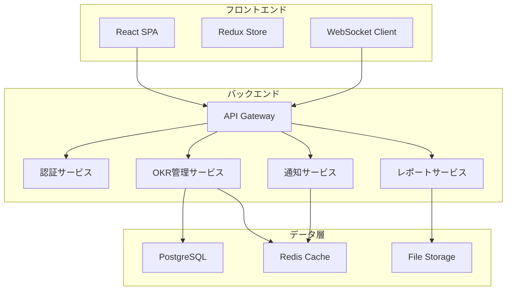

# 設計文書

## 概要

JBP-OKR管理システムは、小売業とパートナー企業間の協業プロジェクトにおけるOKR設定・進捗管理を行うWebアプリケーションです。リアルタイム同期、マルチテナント対応、高いセキュリティを特徴とするSaaS型システムとして設計します。

## アーキテクチャ

### システム構成



### 技術スタック

**フロントエンド:**
- React 18 with TypeScript
- Redux Toolkit (状態管理)
- Material-UI (UIコンポーネント)
- Socket.io-client (リアルタイム通信)
- Chart.js (進捗可視化)

**バックエンド:**
- Node.js with Express
- TypeScript
- Socket.io (WebSocket)
- JWT認証
- Prisma ORM

**データベース:**
- PostgreSQL (メインデータ)
- Redis (セッション・キャッシュ)
- AWS S3 (ファイルストレージ)

## コンポーネントとインターフェース

### 1. 認証・認可システム

**AuthService**
```typescript
interface AuthService {
  login(email: string, password: string, mfaCode?: string): Promise<AuthResult>
  logout(): Promise<void>
  refreshToken(): Promise<string>
  verifyMFA(code: string): Promise<boolean>
}

interface AuthResult {
  user: User
  accessToken: string
  refreshToken: string
  requiresMFA: boolean
}
```

### 2. OKR管理システム

**OKRService**
```typescript
interface OKRService {
  createProject(project: CreateProjectRequest): Promise<Project>
  updateOKR(projectId: string, okr: OKRUpdate): Promise<OKR>
  getProjectProgress(projectId: string): Promise<ProjectProgress>
  invitePartner(projectId: string, invitation: PartnerInvitation): Promise<void>
}

interface OKR {
  id: string
  objective: string
  keyResults: KeyResult[]
  ownerId: string
  partnerId?: string
  createdAt: Date
  updatedAt: Date
}

interface KeyResult {
  id: string
  description: string
  targetValue: number
  currentValue: number
  unit: string
  deadline: Date
  assigneeId: string
  progress: number
}
```

### 3. リアルタイム同期システム

**WebSocketService**
```typescript
interface WebSocketService {
  joinProject(projectId: string): void
  leaveProject(projectId: string): void
  broadcastUpdate(projectId: string, update: ProjectUpdate): void
  onProgressUpdate(callback: (update: ProgressUpdate) => void): void
}

interface ProjectUpdate {
  type: 'OKR_UPDATE' | 'PROGRESS_UPDATE' | 'COMMENT_ADDED'
  projectId: string
  data: any
  userId: string
  timestamp: Date
}
```

### 4. 通知システム

**NotificationService**
```typescript
interface NotificationService {
  sendAlert(alert: AlertNotification): Promise<void>
  sendReminder(reminder: ReminderNotification): Promise<void>
  getNotifications(userId: string): Promise<Notification[]>
  markAsRead(notificationId: string): Promise<void>
}

interface AlertNotification {
  type: 'PROGRESS_DELAY' | 'MILESTONE_ACHIEVED' | 'DEADLINE_APPROACHING'
  recipients: string[]
  projectId: string
  message: string
  priority: 'LOW' | 'MEDIUM' | 'HIGH'
}
```

## データモデル

### 主要エンティティ

```typescript
// ユーザーと企業
interface User {
  id: string
  email: string
  name: string
  companyId: string
  role: UserRole
  isActive: boolean
  lastLoginAt?: Date
}

interface Company {
  id: string
  name: string
  type: 'RETAILER' | 'MANUFACTURER' | 'VENDOR'
  contactEmail: string
  isActive: boolean
}

// プロジェクトとOKR
interface Project {
  id: string
  name: string
  description: string
  ownerId: string
  ownerCompanyId: string
  partners: ProjectPartner[]
  okrs: OKR[]
  status: ProjectStatus
  startDate: Date
  endDate: Date
  createdAt: Date
  updatedAt: Date
}

interface ProjectPartner {
  id: string
  companyId: string
  role: PartnerRole
  permissions: Permission[]
  invitedAt: Date
  acceptedAt?: Date
  status: InvitationStatus
}

// 進捗管理
interface ProgressUpdate {
  id: string
  keyResultId: string
  previousValue: number
  newValue: number
  comment?: string
  updatedBy: string
  updatedAt: Date
}
```

### データベーススキーマ設計

**主要テーブル:**
- users (ユーザー情報)
- companies (企業情報)
- projects (プロジェクト)
- project_partners (プロジェクトパートナー)
- okrs (目標)
- key_results (主要成果)
- progress_updates (進捗更新)
- notifications (通知)
- audit_logs (監査ログ)

## エラーハンドリング

### エラー分類と対応

**1. 認証・認可エラー**
```typescript
class AuthenticationError extends Error {
  code: 'INVALID_CREDENTIALS' | 'MFA_REQUIRED' | 'TOKEN_EXPIRED'
  statusCode: 401 | 403
}
```

**2. ビジネスロジックエラー**
```typescript
class BusinessLogicError extends Error {
  code: 'INVALID_OKR_DATA' | 'PERMISSION_DENIED' | 'PROJECT_NOT_FOUND'
  statusCode: 400 | 404
}
```

**3. システムエラー**
```typescript
class SystemError extends Error {
  code: 'DATABASE_ERROR' | 'EXTERNAL_SERVICE_ERROR'
  statusCode: 500
}
```

### エラー処理戦略

- **フロントエンド**: グローバルエラーハンドラーでユーザーフレンドリーなメッセージを表示
- **バックエンド**: 構造化ログ出力と適切なHTTPステータスコード返却
- **データベース**: トランザクション管理とロールバック機能
- **外部サービス**: リトライ機能とフォールバック処理

## テスト戦略

### テストピラミッド

**1. ユニットテスト (70%)**
- サービスクラスのビジネスロジック
- ユーティリティ関数
- データ変換ロジック
- Jest + Testing Library使用

**2. 統合テスト (20%)**
- API エンドポイント
- データベース操作
- 外部サービス連携
- Supertest使用

**3. E2Eテスト (10%)**
- 主要ユーザーフロー
- クロスブラウザ対応
- Playwright使用

### テストデータ管理

- **開発環境**: シードデータによる一貫したテスト環境
- **テスト環境**: 各テスト実行前のデータベースリセット
- **本番環境**: 匿名化されたデータでのテスト実行

### パフォーマンステスト

- **負荷テスト**: 同時接続ユーザー数の限界測定
- **ストレステスト**: システム限界点の特定
- **レスポンステスト**: API応答時間の監視

## セキュリティ設計

### 認証・認可

**多要素認証 (MFA)**
- TOTP (Time-based One-Time Password)
- SMS認証のバックアップ
- 企業管理者による強制有効化

**権限管理**
```typescript
enum Permission {
  PROJECT_VIEW = 'project:view',
  PROJECT_EDIT = 'project:edit',
  PROJECT_ADMIN = 'project:admin',
  OKR_VIEW = 'okr:view',
  OKR_EDIT = 'okr:edit',
  PROGRESS_UPDATE = 'progress:update',
  REPORT_GENERATE = 'report:generate'
}
```

### データ保護

**暗号化**
- 転送時: TLS 1.3
- 保存時: AES-256暗号化
- 機密データ: 追加の暗号化レイヤー

**監査ログ**
- 全ユーザーアクション記録
- データ変更の追跡
- 不正アクセス検知

### セキュリティ監視

- **リアルタイム監視**: 異常なアクセスパターンの検知
- **定期監査**: セキュリティ設定の確認
- **インシデント対応**: 自動アラートと対応手順

## スケーラビリティ設計

### 水平スケーリング

- **アプリケーション層**: ロードバランサーによる複数インスタンス
- **データベース層**: 読み取りレプリカとシャーディング
- **キャッシュ層**: Redis Clusterによる分散キャッシュ

### パフォーマンス最適化

- **データベース**: インデックス最適化とクエリ最適化
- **API**: レスポンスキャッシュとページネーション
- **フロントエンド**: コード分割と遅延読み込み

## 運用・監視

### 監視項目

- **システムメトリクス**: CPU、メモリ、ディスク使用率
- **アプリケーションメトリクス**: レスポンス時間、エラー率
- **ビジネスメトリクス**: アクティブユーザー数、OKR達成率

### ログ管理

- **構造化ログ**: JSON形式での統一ログ出力
- **ログ集約**: ELKスタックによる集中管理
- **アラート**: 重要なエラーの